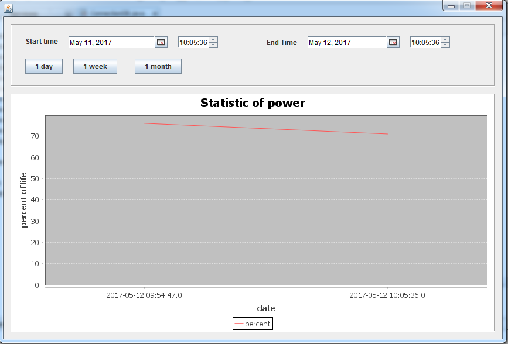

# battery-statistic
Desktop app, written in Swing - Neatbeans

Delay time in 5 minute. Datebase file attached to this repository, you can import to your database(mysql).

Used library: 
* JFreeChart - http://www.jfree.org/jfreechart/
* JNA - https://github.com/java-native-access/jna
* JCommon - http://www.jfree.org/jcommon/
* MySQL Connector/J - https://dev.mysql.com/downloads/connector/j/

